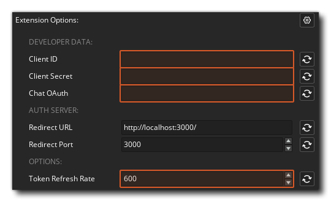

@title Setup

# Setting up the Twitch Extension

This page contains details on setting up the Twitch Extension.

## Registering Your App

To get started you first need to register your app with Twitch. See [Registering Your App](https://dev.twitch.tv/docs/authentication/register-app/).

Make sure to note down the **Client ID** and **Client Secret** and keep them in a secure place.

## Required Extensions

Android and iOS require the [GMEXT-WebView](https://github.com/YoYoGames/GMEXT-WebView) extension.

## Extension Options

In the [Extension Options](https://manual.gamemaker.io/monthly/en/The_Asset_Editors/Extensions.htm#extension_options), enter the **Client ID** and **Client Secret** as well as the **Chat OAuth**.

You can optionally change the **Token Refresh Rate**, which determines after how many seconds to refresh the access token. The minimum value is 10 seconds.